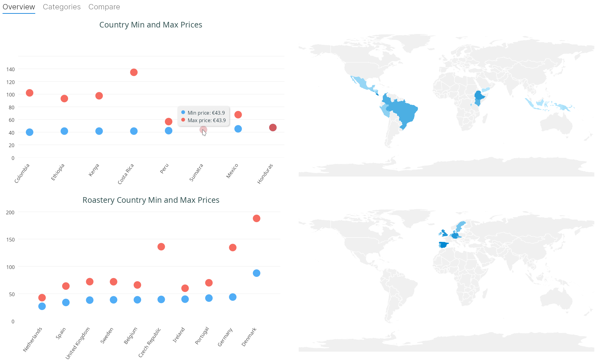
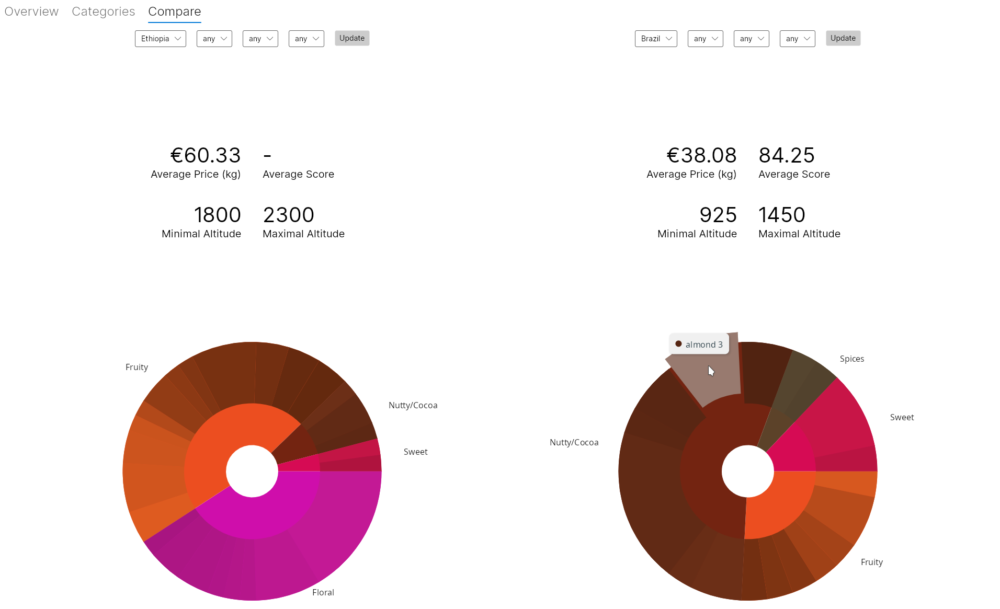
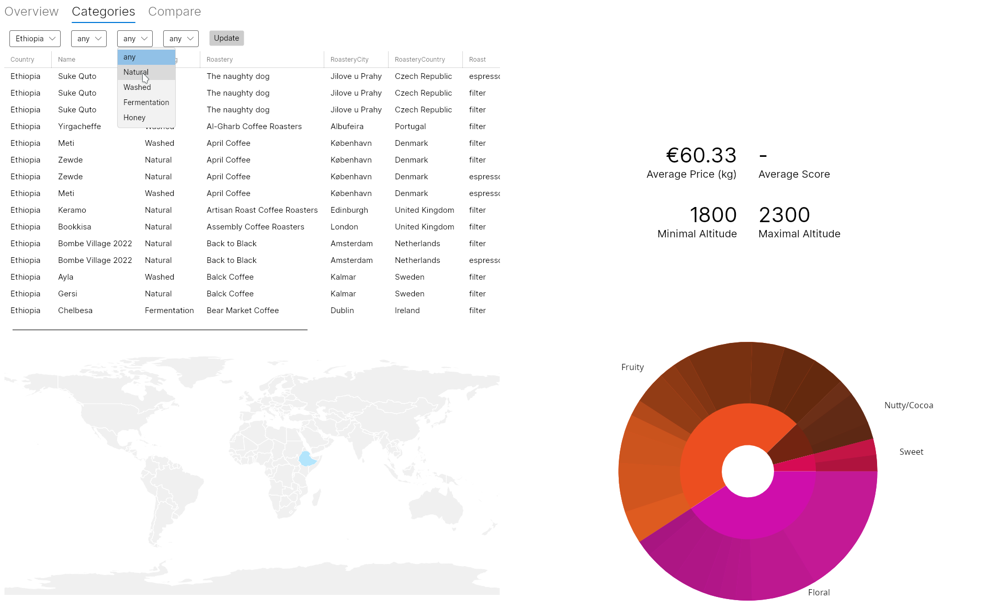

# PA214 Project - European Coffee Roasteries

This project aims to visualize and compare coffees produced by roasteries in Europe. The initial dataset contains only 111 samples of coffee but is diverse enough to show the capabilities of the visualizations. I decided to implement the solution in F# to test its data processing and visualization capabilities.


## Authors

- [Adela Bierska](https://www.github.com/adbi13)


## Installation

The application needs [.NET 7.0](https://dotnet.microsoft.com/en-us/download). After installation run this script to start the program:

```bash
    cd project/EuropeanCoffees
    dotnet run
```


## License

[BSD 3-Clause License](https://choosealicense.com/licenses/bsd-3-clause/)


## Screenshots






