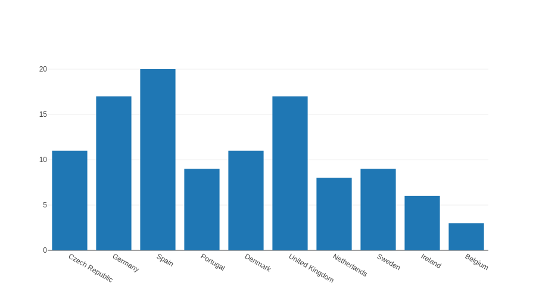
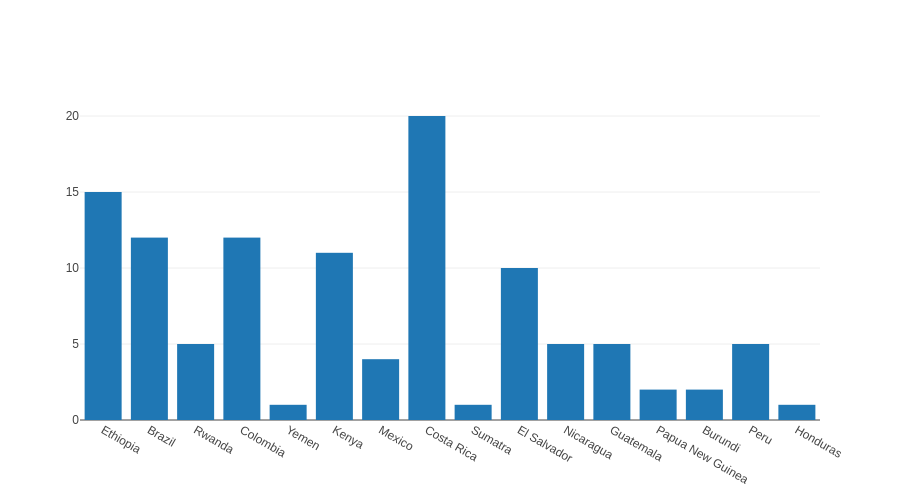
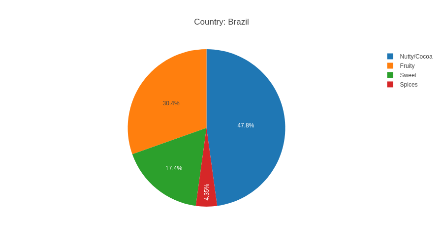
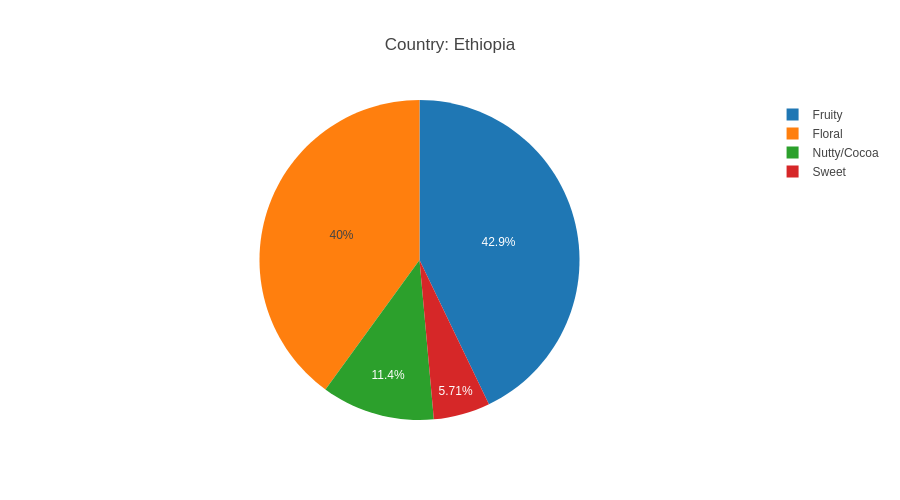
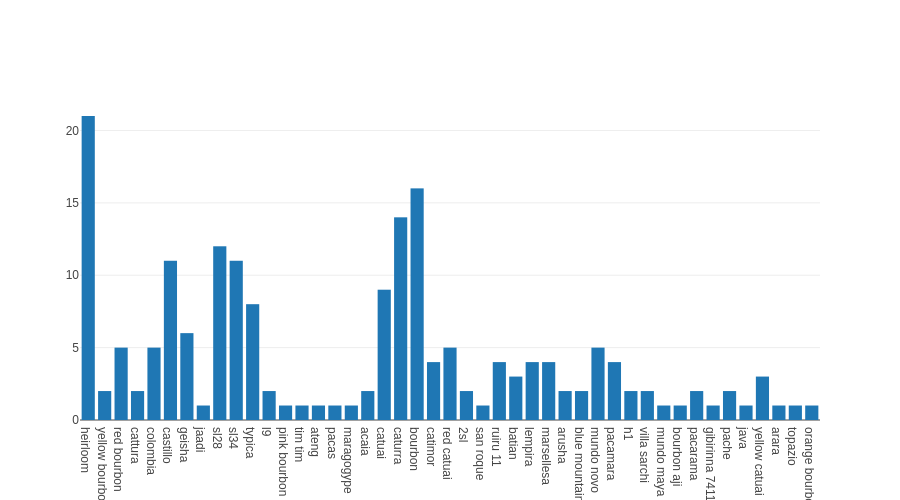
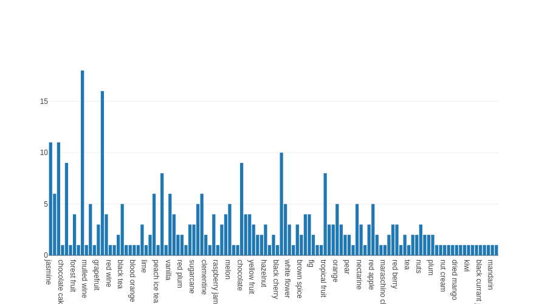
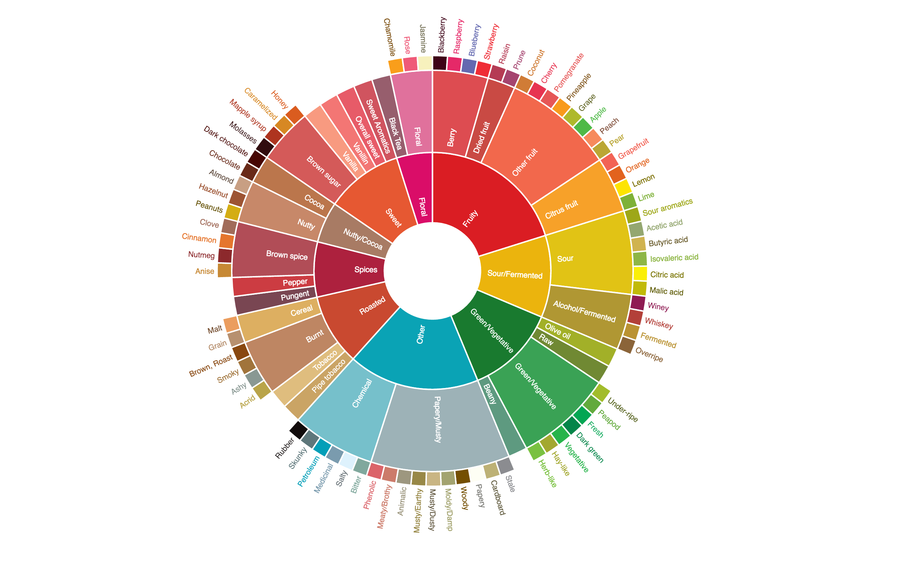

# PA214 Project
## European Coffee Roasteries

The aim of this project is to visualize and compare coffees produced by roasteries in Europe. The initial dataset contains only 111 samples of coffee but diverse enough to show capabilities of the visualizations. I decided to implement whole solution in F# to test its capabilities in the area of data processing and visualizations.

## Columns
The collected dataset contains these columns: Roastery, Roastery City, Roastery Country, Name, Country, Region, Farm, Processing, Variety, Altitude min, Altitude max, Price (EUR per kg), Profile, Roast, Score

### Roastery
Name of the roastery, should be unique at least within country and city. It does not really carry any important information, but it is good for more detailed distingushing between samples. Maybe we can try to compare roasters' taste preferences.

### Roastery City
Carries even lesser information than roastery name, but it belongs to the roasteries and I believe it is nice present them together. I had an idea to compare e.g. coffee prices between small and big cities, but it would be too complicated processing another dataset just to provide this information as I believe there wold not be any significant difference.

### Roastery Country
There are some theories that for example people from the north Europe prefer more bitter coffee than people from the south. Maybe we can find some other differences between nationalities. The samples' roastery country is also important to understand variability of the price as I already noticed that prices across countries quite differs. I would like to try to use some chloropleth maps.

### Name (of the coffee)
This column is truly random, each roastery has its own way how to name their coffee so its only for a nice header.

### Country (of origin)
One of the most important columns as it can be visualised by so many ways! It affects many other columns as varieties, processings etc. I tried to do some pie charts to compare taste ratios between countries and it looks like there will be some nice results. E.g. coffee from Brazil typically has cocoa or nuts notes, in opposite coffee from Ethiopia is more floral and fruity. I know that from real life by tasting many various coffees and it is nice to see that data agrees with me.

### Region & Farm
These are here to have the data more complete, I do not have any plans to use them.

### Processing
Very nice categorical data which directly affect the taste of the coffee. I think a lot about how to cope with fermentation here as there are many types of it and I do not wont so many small fermentation categories within my dataset.

### Variety
Singular in the name of this columns is not really correct because it is normal to mix many varieties within one batch of coffee. That is why type of this column is `string list` which is quite impractical.

### Altitude min & max
An altitude also affects the taste of the coffee but I am not sure how to visualize this combination of numeric and categorical data. Maybe I can divide the altitude to some levels as *low*, *high* etc.

### Price
An actual price of 1 kg of the sample in EUR. Prices are always nice for comparsion so I think I will use it a lot.

### Profile
Base raw data for the taste analysis and visualization. There are many profiles in the dataset as its the most concrete specification and it strongly depends on roaster's perfectionism and cultural (from food point of view) background. Due to this it is impossible to use profiles as they are so I used flavor wheel to assign major taste to each of the profiles.

### Roast
Division to espresso (dark) or filter (light) roast.

### Score
Really nice piece of data, unfortunatelly only few samples have this column filled so it is quite useless.

