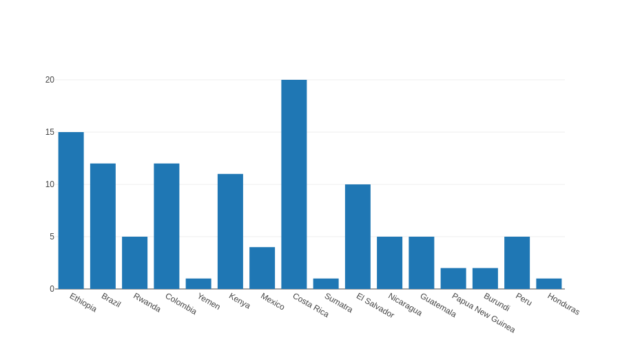
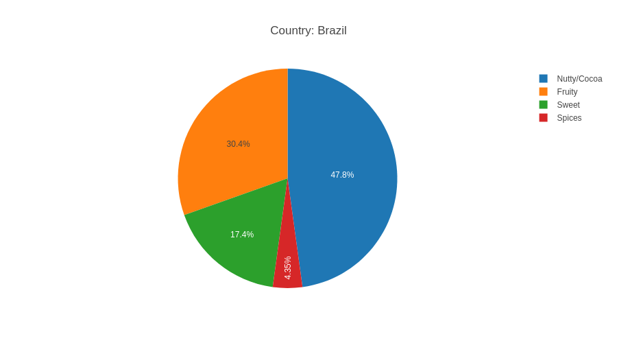
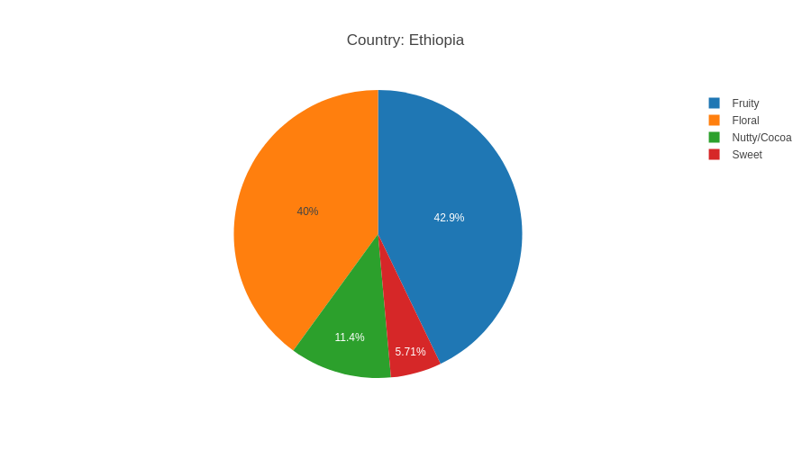
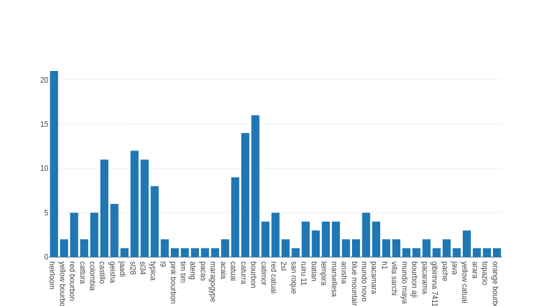
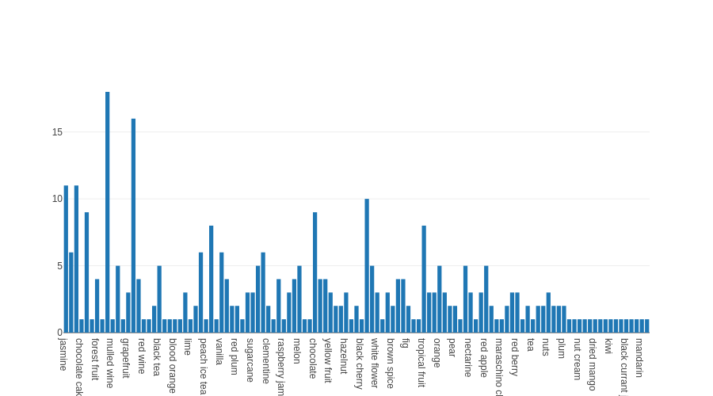

# Data Description

## Columns
The collected dataset contains these columns: Roastery, Roastery City, Roastery Country, Name, Country, Region, Farm, Processing, Variety, Altitude min, Altitude max, Price (EUR per kg), Profile, Roast, Score.

### Roastery
The name of the roastery should be unique, at least within the country and city. It does not really carry any important information, but it is good for more detailed distinguishing between samples. Maybe I can try to compare roasters' taste preferences.

### Roastery City
It carries even lesser information than the roastery name, but it belongs to the roasteries, and I believe it is nice to present them together. I had an idea to compare, e.g., coffee prices between small and big cities, but it would be too complicated processing another dataset just to provide this information as I believe there would not be any significant difference.

### Roastery Country
There are some theories that, for example, people from northern Europe prefer more bitter coffee than people from the south. Maybe we can find some other differences between nationalities. The samples' roastery country is also important to understand the price variability as I already noticed that prices across countries quite differ. I would like to try to use some choropleth maps.

### Name (of the coffee)
This column is truly random. Each roastery has its own way how to name its coffee, so it is only for a nice header.

### Country (of origin)
One of the most important columns, as it can be visualized in so many ways! It affects many other columns, such as varieties, processing, etc. I tried to do some pie charts to compare taste ratios between countries, and it looks like there will be some nice results. E.g., coffee from Brazil typically has cocoa or nuts notes. On the opposite, coffee from Ethiopia is more floral and fruity. I know that from real life by tasting various coffees, and it is nice to see that the data agrees with me.

### Region & Farm
These are here to have the data more complete. I do not have any plans to use them.

### Processing
Very nice categorical data, which directly affects the taste of the coffee. I think a lot about how to cope with fermentation here as there are many types of it, and I do not want so many small fermentation categories within my dataset.

### Variety
Singular in the name of this column is not really correct because it is usual to mix more varieties within one batch of coffee. That is why the type of this column is `string list`, which is quite impractical.

### Altitude min & max
An altitude also affects the taste of the coffee, but I am not sure how to visualize this combination of numeric and categorical data. Maybe I can divide the altitude into some levels as *low*, *high*, etc.

### Price
An actual price of 1 kg of the sample in EUR. Prices are always nice for comparison, so I think I will use them a lot.

### Profile
Base raw data for taste analysis and visualization. There are many profiles in the dataset as its the most concrete specification, and it strongly depends on the roaster's perfectionism and cultural (from a food point of view) background. Due to this, it is impossible to use profiles as they are, so I used the [The Coffee Taster's Flavor Wheel created by SCAA](https://sca.coffee/research/coffee-tasters-flavor-wheel) to assign a major taste to each of the profiles.

### Roast
Division to espresso (dark) or filter (light) roast.

### Score
This is a really nice piece of data; unfortunately, only a few samples have this column filled, so it is pretty useless.

